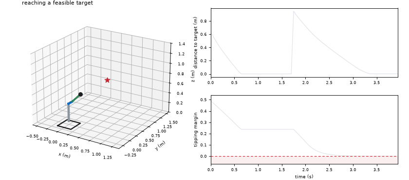
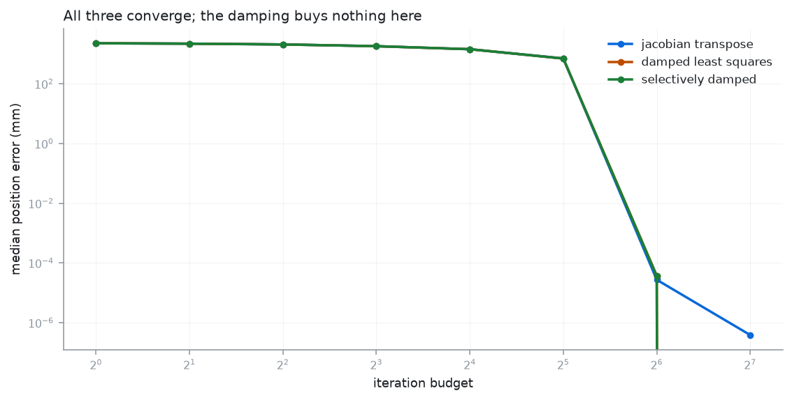
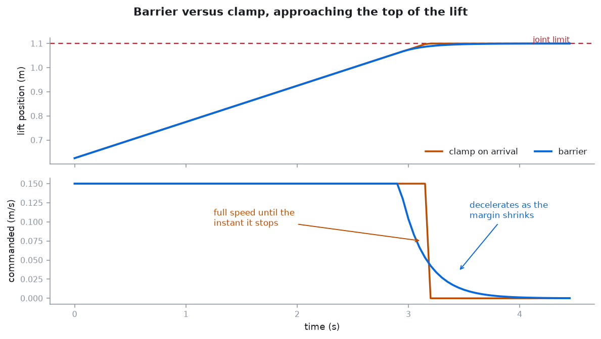
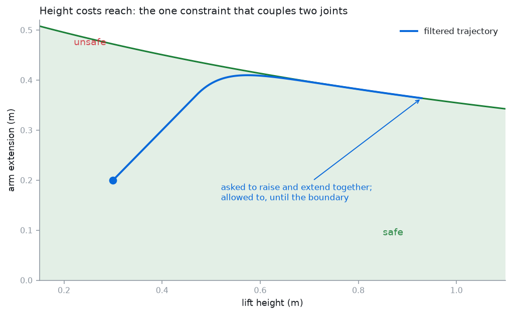
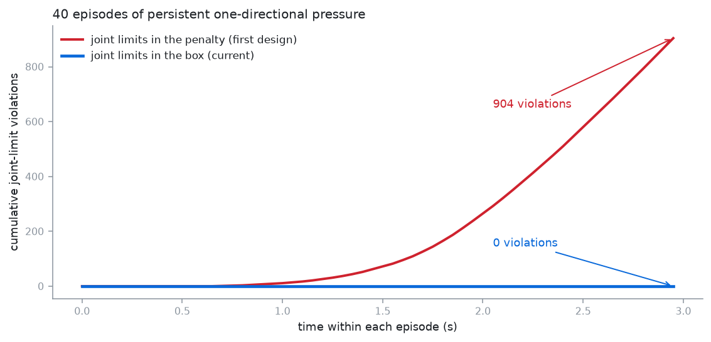

# Whole-body control for a Hello Robot Stretch 3

Eight degrees of freedom — mobile base, lift, telescoping arm, three wrist
joints — solved as **one system**, with a QP safety filter between any
controller and the robot.

Three inverse-kinematics solvers, benchmarked against each other on 1,000
reachable targets. A control-barrier safety filter that takes a hostile
controller's joint-limit violations to zero. A behaviour-cloned policy that
demonstrates why the filter has to be there. And a C++ port of the filter,
cross-checked against the Python reference case by case.



Grey is the lift mast, blue the telescoping arm, the red star is the target.
The arm turns orange whenever the filter is overriding the controller. In the
second half the target needs height and reach at once, and the tipping margin
in the lower trace falls to exactly zero and stops there — the filter walks the
robot up to the constraint and not past it.

**Status:** personal project, rebuilt and published 2026. Python 3.10+, numpy
for the core; PyTorch only for the cloning module.

```bash
pip install -e ".[dev]"
pytest                              # 52 tests, no robot required
python examples/01_solver_benchmark.py
python examples/02_safety_benchmark.py
python examples/03_behaviour_cloning.py   # needs the learning extra
python examples/04_demo_animation.py   # renders the gif above
python examples/make_figures.py
```

---

## Why whole-body, and what it costs

Stretch's arm is almost entirely prismatic and extends **sideways**, so its
reachable set from a parked base is close to a plane. Planning the base first
and the arm second means committing to a base pose before knowing whether the
arm can finish the job — and the usual result is a base parked slightly wrong
with an arm that cannot quite reach.

Solving all eight together removes that commitment, and introduces the thing
that makes this robot interesting: **sliding the base sideways and extending
the arm produce the same tool motion.** Those two Jacobian columns are exactly
parallel, so the system is genuinely rank-deficient across a large part of the
workspace, not merely ill-conditioned at isolated poses. There is a test
asserting the cosine between those columns is 1.

That single fact explains the solver benchmark below.

---

## 1. Three IK solvers, 1,000 targets

Every target is generated from a valid configuration's forward kinematics, so
all 1,000 are reachable by construction — otherwise the success rate would
measure the sampler. Every solver starts from the same neutral seed rather than
near the answer.

| solver | solved | median err | p95 err | iters | ms |
|---|---:|---:|---:|---:|---:|
| **jacobian transpose** | **997/1000** | 0.685 mm | 0.99 mm | 56 | 59.4 |
| damped least squares | 970/1000 | 0.681 mm | 0.99 mm | 57 | 53.6 |
| selectively damped | 970/1000 | 0.684 mm | 0.99 mm | 57 | 64.7 |



**The simplest method wins, and that is the expected result here rather than a
surprise.** Damping exists to survive singularities, and it survives them by
giving up accuracy in the degenerate direction. On this robot the degeneracy is
everywhere, so that trade is being paid constantly. Jacobian transpose has no
inverse to condition — it just steps downhill — which costs iterations and
loses nothing.

Selectively damped least squares does more arithmetic per iteration for no
measurable benefit on this problem. It is kept because "we tried it and it did
not help here" is a result.

---

## 2. The safety filter

A control-barrier QP between the controller and the robot:

    minimise   ||dq - dq_desired||²
    subject to  box_lower ≤ dq ≤ box_upper          (exactly)
                coupling constraints                 (penalised)

Projecting onto the feasible set rather than clipping matters: a controller
asking to move diagonally into a corner should slide along the corner, not lose
one axis entirely.

### What it is worth

200 episodes × 60 steps, hostile controller asking for large random velocities,
nothing clamped afterwards:

| | unfiltered | filtered |
|---|---:|---:|
| joint-limit violations | 9,704 | **0** |
| commands over velocity limit | 12,000 | **0** |
| worst excursion past a limit | 1.778 m | **0.000 m** |
| tipping violations | 4,025 | 485 |

A barrier decelerates into a limit instead of arriving at full speed and
stopping dead:



### The tipping count does not reach zero, and cannot

Roughly a fifth of uniformly sampled configurations start **outside** the
tipping-safe set, and no velocity within the motors' limits returns them in one
step. The filter relaxes that constraint by the smallest amount that admits an
executable command, drives the margin back up, and reports how much it gave up.
A filter claiming zero here would be one that had quietly redefined the
constraint.



Arm extension and lift height multiply rather than add: full reach is fine near
the floor and not fine at full height. No per-joint bound can express that,
which is what makes this a QP rather than eight clamps.

**The tipping model is a stand-in, not a measured stability model.** The real
thing needs mass distribution, payload and base acceleration, none of which
this repository has. What it *is* is a genuine coupling constraint, which is
what the filter needs to be exercised against. Replace it before trusting it on
hardware.

---

## 3. The bug that shaped the design

The first version put every constraint in the penalty. Then a behaviour-cloned
policy was run through it and produced **132 joint-limit violations across 50
rollouts** — from a filter whose entire job is preventing exactly that.

The cause: a learned policy pushes the *same direction* for many steps. The
earlier hostile-controller test picked a new random velocity each step, so it
jittered and never leaned on one limit. Under persistent pressure, and in
conflict with the coupling constraint, the penalty let joints through.

The fix is structural rather than a tuning change. A joint-position barrier
`dq_j ≤ α(upper_j − q_j)` touches **one joint**, so it is axis-aligned — it is
a box bound, and boxes are enforced by clipping every iterate, exactly and for
free. Only genuinely coupling constraints belong in the penalty.



904 violations against 0, on the same 40 episodes of persistent pressure. Both
tests are in the suite.

There was an earlier wrong turn too, recorded in the docstrings: the dual was
first solved with **Hildreth's coordinate descent**, which stalled on the
augmented problem and returned commands exceeding the velocity limits by
0.135 rad/s while reporting nothing unusual. A safety filter that returns an
unexecutable command *that looks like a normal answer* is the worst failure
mode available. Accelerated projected gradient replaced it.

---

## 4. Behaviour cloning, and why the filter stays in the loop

An MLP cloned from the damped-least-squares controller, evaluated three ways:

```
1. Open loop, on held-out EXPERT states
   action MSE            0.119

2 and 3. Closed loop, policy driving from its own states
                                 unfiltered    filtered
reached (5 mm tolerance)                  0           0
within 50 mm                              2           1
joint-limit violations                  635           0
filter interventions                      0        1465
median final error (mm)               248.9       265.6
```

The expert finishes 106 of its own 120 episodes. The clone finishes none at the
same tolerance while getting median error down to 249 mm — it learned the gross
motion and not the endgame, which is what compounding error looks like. More
epochs do not fix it; it is a property of training on one state distribution
and running on another. DAgger is the standard fix and is **not** implemented
here.

The row that matters for deployment is the violations. The network was never
told joint limits exist, and nothing in its loss made exceeding one different
from any other error. **The filter is what makes a learned controller safe to
run — not better training.**

---

## 5. The C++ port

`cpp/` carries the filter for the real-time side of a ROS 2 stack, where the
control loop should not be holding the GIL.

```bash
cmake -S cpp -B cpp/build -DCMAKE_BUILD_TYPE=Release
cmake --build cpp/build --parallel
ctest --test-dir cpp/build --output-on-failure
```

Two implementations of the same algorithm drift unless something stops them.
`tools/generate_golden.py` runs the Python solver over a fixed set of states and
writes its answers into a header the gtest suite compares against, and CI
regenerates that header and fails on any diff. A port that quietly diverges from
its reference is worse than no port, because each one looks correct alone.

---

## What this does not do

- **Position only.** The Jacobian is 3×8; tool *orientation* is not controlled.
  Adding it means a 6×8 Jacobian and a decision about how to weight rotation
  against translation, which this does not make.
- **Kinematics, not dynamics.** No masses, no torque limits, no contact. The
  tipping constraint is a stand-in for the stability model that would need
  them.
- **The C++ port is only the filter.** The solvers and the model stay in Python.
- **No ROS 2 node is included**, only the library the node would wrap. Adding
  the node is mechanical; getting the filter right was not.
- **No hardware.** Nothing here has been run on a Stretch. The kinematic
  parameters are plausible rather than measured, and every number on this page
  comes from simulation.
- **`solve()` allocates.** Making the C++ path allocation-free is worthwhile for
  a hard real-time thread and is not done, because it has not been profiled in a
  real loop yet.

---

## Layout

```
src/stretchwbc/
  model.py      8-DOF kinematics, analytic Jacobian, joint limits
  ik.py         three solvers behind one interface
  safety.py     the QP filter, control barriers, the tipping constraint
  policy.py     behaviour cloning and closed-loop rollouts
cpp/
  include/, src/, test/   the filter in C++, with golden cross-checks
tools/
  generate_golden.py      regenerates the C++ reference values
examples/
  01..04, make_figures.py the numbers, the gif and the pictures above
```

---

## References

- Ames et al. (2019), *Control Barrier Functions: Theory and Applications*
- Buss and Kim (2005), *Selectively Damped Least Squares for Inverse Kinematics*
- Nakamura and Hanafusa (1986), on damped least squares near singularities
- Yoshikawa (1985), *Manipulability of Robotic Mechanisms*
- Ross and Bagnell (2011), *DAgger*, on the compounding error above
- Beck and Teboulle (2009), *FISTA*, the solver used for the dual

---

## License

MIT — see [LICENSE](LICENSE).

Parth Deshmukh
